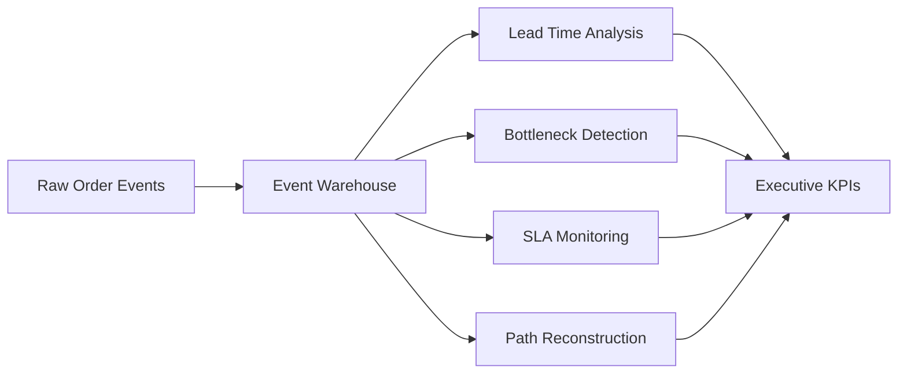

<div align="center">

# 📦 Order Fulfillment & Late-Shipment Analytics Warehouse

### Event-Driven SQL Warehousing • Bottleneck Detection • SLA Intelligence

*A production-style logistics analytics project demonstrating star schema design, event-stream modeling, advanced SQL, shipment bottleneck analysis, and operational performance intelligence.*


</div>

---

# 📖 Overview

Modern logistics operations generate thousands of shipment events every day. A single `status` column is not enough to understand **where delays happen, why they happen, and how they propagate across the fulfillment pipeline**.

This project models order fulfillment as an **event-driven warehouse**, enabling stage-level analytics, SLA monitoring, bottleneck detection, and shipment-path intelligence.

The focus is not just writing SQL queries — it is demonstrating **how a BI Developer or Analytics Engineer would design a warehouse for operational decision-making**.

---

# 🚀 Key Features

- 🏗️ **Star Schema Warehouse Design**
- ⏱️ **Event-Level Shipment Tracking**
- 📉 **Late-Shipment Root Cause Analysis**
- 🔄 **Multi-Hop Shipment Path Reconstruction**
- 📊 **Warehouse & Carrier Performance Analytics**
- ⚡ **Window Functions & Recursive CTEs**
- 🧠 **Gaps-and-Islands Detection**
- 📦 **Inventory Snapshot Analytics**
- 📈 **Pre-Aggregated KPI Rollups**
- 🚀 **Query Optimization Ready**

---

# 📊 Dataset Summary

<div align="center">

| Metric | Value |
|---|---|
| Orders | **4,000+** |
| Event Records | **28,600+** |
| Warehouses | **6** |
| Carriers | **5** |
| Products | **180** |
| Customers | **600** |
| Delivery Window | **6 Months** |
| Exception Rate | **7%** |
| Return Rate | **1.5%** |
| Multi-Hop Shipments | **5%** |

</div>

---

# 🏗️ Warehouse Architecture

## Dimension Tables

- `dim_date`
- `dim_warehouse`
- `dim_carrier`
- `dim_product`
- `dim_customer`

## Fact Tables

- `fact_order_events`
- `fact_inventory_snapshot`
- `fact_shipment_cost`
- `agg_daily_ontime_performance`

---

# 🔄 Analytics Workflow

<div align="center">



</div>

---

# 📂 Repository Structure

```text
order-fulfillment-analytics/
│
├── 01_schema.sql
├── generate_data.py
├── logistics.db
├── dim_warehouse.csv
├── fact_order_events.csv
└── README.md
```

---

# 🧠 Business Questions Answered

### SLA Intelligence

- Which carriers miss delivery commitments most often?
- Which warehouses contribute the highest delay volume?

### Bottleneck Analysis

- Which fulfillment stage has the highest average dwell time?
- Where do shipments get stuck for 48+ hours?

### Shipment Intelligence

- Which orders require multiple transfer hubs?
- How do hub delays affect final delivery time?

### Inventory & Returns

- Which SKUs have the highest turnover?
- Which warehouses experience the highest return rate?

---

# 📈 Advanced SQL Techniques

This project demonstrates:

- `LAG()` / `LEAD()`
- Running & rolling aggregates
- Recursive CTEs
- Gaps-and-Islands pattern
- Stage-to-stage lead-time calculations
- SLA breach detection
- Multi-table root-cause joins
- Pre-aggregated KPI tables

---

# 🔍 Example Analysis

## Detect Stuck Shipments

```sql
SELECT order_id,
       MAX(event_ts) AS last_update
FROM fact_order_events
GROUP BY order_id
HAVING julianday('now') - julianday(MAX(event_ts)) > 2;
```

## Warehouse Delay Ranking

```sql
SELECT warehouse_name,
       AVG(delay_hours) AS avg_delay
FROM warehouse_delay_metrics
GROUP BY warehouse_name
ORDER BY avg_delay DESC;
```

## Carrier SLA Performance

```sql
SELECT carrier_name,
       on_time_rate
FROM carrier_sla_metrics
ORDER BY on_time_rate DESC;
```

---

# ⚠️ Realistic Operational Noise

To simulate production logistics data, the generator intentionally injects:

- Missing fulfillment events
- Weather disruptions
- Address exceptions
- Capacity constraints
- Damaged shipments
- Multi-hop routing
- Returns after delivery
- SLA violations

This creates realistic edge cases commonly encountered in real fulfillment systems.

---

# 🛠️ Tech Stack

<div align="center">

| Category | Technology |
|---|---|
| Data Warehouse | PostgreSQL |
| Local Analytics | SQLite |
| Data Generation | Python |
| Querying | SQL |
| Modeling | Star Schema |
| Optimization | Indexing & Query Tuning |

</div>

---

# 💼 Skills Demonstrated

- Data Warehousing
- Dimensional Modeling
- Event-Driven Architecture
- Advanced SQL
- Logistics Analytics
- KPI Design
- Root Cause Analysis
- SLA Monitoring
- Query Optimization
- Business Intelligence

---

# 🌟 Why This Project Stands Out

Unlike typical SQL portfolio projects that stop at CRUD operations or simple reporting, this project demonstrates **how operational analytics teams investigate late deliveries, isolate bottlenecks, and design executive-ready warehouse metrics from event-level data**.

It is designed to showcase the kind of thinking expected from:

- **BI Developers**
- **Analytics Engineers**
- **Data Analysts**
- **Supply Chain Analysts**
- **Data Engineers**

---

<div align="center">

### ⭐ If you found this project useful, consider starring the repository!

Built for demonstrating **production-style SQL warehousing and logistics analytics**.

</div>
